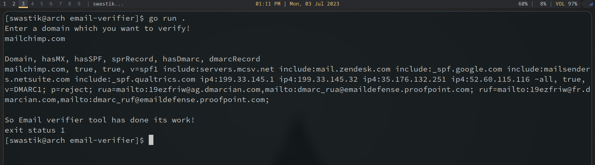
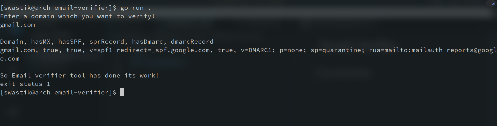

Email-Verifier
====
## Usage
Enter the email domain after using command
```
go run verifier.go
```

It will print `hasMX= true` if Mail exchanger record is there and `sprRecord` if `hasSPF= true`, `dmarcRecord` if `hasDmarc= true`.
## Screenshots
---





